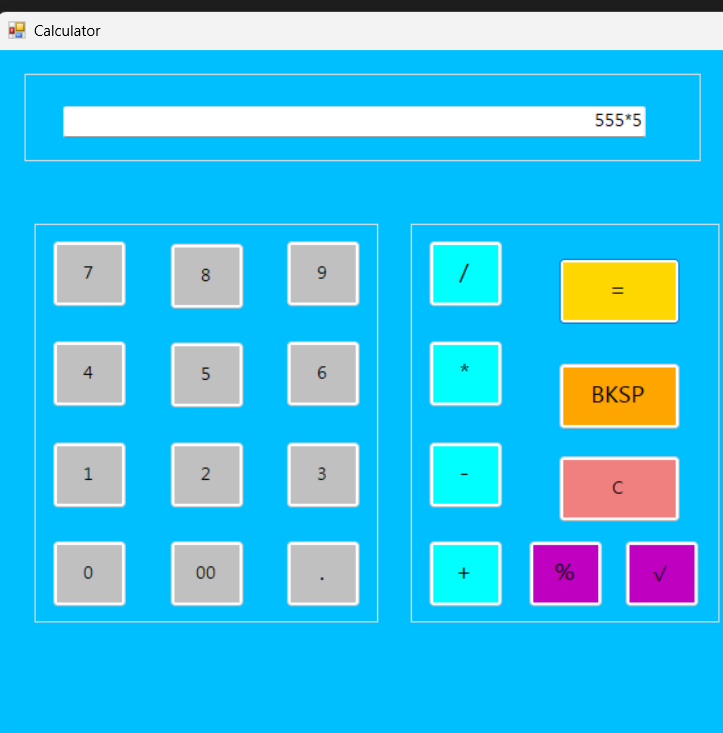

<br> # 🧮 C# Simple Calculator </br>

### ⚡ A Modern Windows Forms Desktop Calculator


:::

------------------------------------------------------------------------

## 🌟 About The Project

**C# Simple Calculator** is a Windows desktop calculator application
developed using **C# and Windows Forms**.

The project focuses on practical GUI programming and demonstrates how
buttons, text boxes, events, mathematical operations, validation, and
exception handling work together to create a functional desktop
application.

> 💡 **Learning by Building:** This project was created to strengthen C#
> programming, Windows Forms, event handling, and problem-solving
> skills.

------------------------------------------------------------------------

## ✨ Key Features

  -----------------------------------------------------------------------
  Feature                             Description
  ----------------------------------- -----------------------------------
  🔢 **Number Input**                 Supports `0–9`, `00`, and decimal
                                      values

  ➕ **Addition**                     Performs addition operations

  ➖ **Subtraction**                  Performs subtraction operations

  ✖️ **Multiplication**               Performs multiplication operations

  ➗ **Division**                     Performs division with
                                      zero-division protection

  📊 **Percentage**                   Supports percentage calculations

  √ **Square Root**                   Calculates square root using
                                      `Math.Sqrt()`

  🟰 **Equals**                       Calculates and displays the final
                                      result

  ⌫ **Backspace**                     Removes the last entered character

  🧹 **Clear**                        Clears the calculator display

  ⚠️ **Error Handling**               Displays `Error` for invalid
                                      operations

  🎨 **Custom UI**                    Styled buttons with a colorful
                                      calculator interface
  -----------------------------------------------------------------------

------------------------------------------------------------------------

## 🖥️ Calculator Preview




**Clean UI • Colorful Controls • Simple Interaction**
:::

> 📌 If your screenshot has a different filename, replace
> `Screenshot.png` above with the actual image filename in your
> repository.

------------------------------------------------------------------------

## 🧮 Supported Calculations

``` text
25 + 15  = 40
25 - 15  = 10
25 * 4   = 100
100 / 4  = 25
√25      = 5
```

### 🚨 Error Examples

``` text
10 / 0       → Error
Invalid input → Error
√(-25)       → Error
```

------------------------------------------------------------------------

## 🎨 UI Theme

The calculator uses a bright, modern color palette to make different
operations easy to recognize.

  Control              Style
  -------------------- -------------
  🔢 Number Buttons    Light Gray
  ➕➖✖️➗ Operators   Cyan
  🟰 Equals            Yellow
  ⌫ BKSP               Orange
  🧹 Clear             Red
  📊 % / √             Purple
  🖥️ Main Background   Cyan / Blue

------------------------------------------------------------------------

## 🧠 What This Project Demonstrates

### C# Programming

-   Variables and data types
-   Conditional statements
-   `switch` statements
-   Exception handling
-   Type conversion
-   String manipulation
-   Mathematical functions

### Windows Forms

-   `Form`
-   `Button`
-   `TextBox`
-   Click events
-   Shared event handlers
-   Properties and controls
-   Designer-based UI development

### Problem Solving

-   Input validation
-   Division-by-zero protection
-   Invalid expression handling
-   Calculator operation flow

------------------------------------------------------------------------

## 🔄 How It Works

``` text
        ┌─────────────────┐
        │   User Input    │
        └────────┬────────┘
                 ↓
        ┌─────────────────┐
        │  Button Click   │
        └────────┬────────┘
                 ↓
        ┌─────────────────┐
        │ TextBox Display │
        └────────┬────────┘
                 ↓
        ┌─────────────────┐
        │   Calculation   │
        └────────┬────────┘
                 ↓
        ┌─────────────────┐
        │ Result / Error  │
        └─────────────────┘
```

------------------------------------------------------------------------

## 🛠️ Tech Stack

``` text
Language       : C#
Framework      : Windows Forms / .NET
IDE            : Visual Studio 2022
Platform       : Windows
Project Type   : Desktop Application
```

------------------------------------------------------------------------

## 📂 Project Structure

``` text
Cal/
│
├── Form1.cs
├── Form1.Designer.cs
├── Form1.resx
├── Program.cs
├── Cal.csproj
├── Cal.slnx
├── README.md
└── Screenshot.png
```

> File names can vary depending on the Visual Studio project
> configuration.

------------------------------------------------------------------------

## 🚀 Getting Started

### Requirements

-   Windows PC
-   Visual Studio 2022 or compatible Visual Studio version
-   .NET / Windows Forms development workload

### Run Locally

``` bash
git clone https://github.com/dhruvprajapati6/Cal.git
```

Then:

1.  Open the project in Visual Studio.
2.  Open the `.slnx` solution file or project file.
3.  Select **Build → Rebuild Solution**.
4.  Press **F5** or click **Start**.
5.  Start calculating! 🧮

------------------------------------------------------------------------

## 🧪 Example Workflow

``` text
Input:
5000 * 5

Press:
=

Output:
25000
```

Another example:

``` text
Input:
99 / 20

Press:
=

Output:
4.95
```

------------------------------------------------------------------------

## 🧩 Main Controls

``` text
┌───────────────────────────────────────────────┐
│                    DISPLAY                    │
├───────────────────┬───────────────────────────┤
│  7   8   9        │   /       =               │
│  4   5   6        │   *      BKSP             │
│  1   2   3        │   -       C               │
│  0  00   .        │   +       %       √       │
└───────────────────┴───────────────────────────┘
```

------------------------------------------------------------------------

## 🔮 Future Enhancements

-   ⌨️ Full keyboard support
-   🌙 Dark / Light theme switcher
-   📜 Calculation history
-   📋 Copy result button
-   🧠 Scientific calculator mode
-   🔢 Advanced mathematical functions
-   💾 Save calculation history
-   🎨 More interactive animations
-   📱 Improved responsive layout

------------------------------------------------------------------------

## 📈 Project Status

::: {align="center"}
### ✅ COMPLETED

**Version:** `1.0.0`

The core calculator functionality and user interface are implemented.
:::

------------------------------------------------------------------------

## 👨‍💻 Author

::: {align="center"}
### **Dhruv Prajapati**

BCA Student • C# Developer • Web & Software Development Learner

**GitHub:** [@dhruvprajapati6](https://github.com/dhruvprajapati6)
:::

------------------------------------------------------------------------

## ⭐ Support

If you like this project:

-   ⭐ Give the repository a **Star**
-   🍴 Fork the project
-   💡 Suggest improvements
-   🐛 Report bugs
-   🚀 Share the project

------------------------------------------------------------------------

::: {align="center"}
### 🧮 Built with C# • Designed with Windows Forms • Created for Learning

**Made with ❤️ by Dhruv Prajapati**
:::
